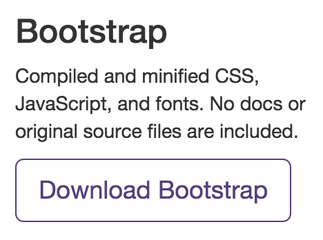

# jQuery + Bootstrap == <3

A Match Made in Open-Source Heaven

## Hi, I'm Alan

 * 8 Years of development experience
 * I've taught for Girl Develop It, Grand Circus, Apigee
 * I started Apprend
 * Freelance as 13protons -  Web Dev & Graphic Design

## Here's how you can contact me

 * @apprenddetroit
 * alan@apprend.org
 * (734) 707-1908

 Please tweet responsibly

# Apprend

Apprend is a new tech education company in Detroit. We're building curriculum and holding classes throughout 2015.

---

This presentation is a test run for a longer-form jQuery + Bootstrap class that's coming up March 23.

## Join Apprend's Mailing List

Please join our monthy-ish mailing list to find out about all the great events that are being scheduled. You can find it by visiting [apprend.org](/) and scrolling to the bottom of the home page.

## Get Involved

If you want to get involved with Apprend as a student or instructor, please join our meetup group at [meetup.com/apprend](http://meetup.com/apprend).

## Upcoming Events

[**Intro to Programming**](http://apprend.org/events/2015/February-Into-To-Programming/)
Learn how to program in JavaScript over 4 nights.
Monday March 2 - Wednesday March 11, $180

[**jQuery + Bootsrtap**](http://apprend.org/events/2015/jQuery-Bootstrap/)
Two day, 6 hour, class for creating more dynamic and sophisticated web sites.
Monday March 23 - Wednesday March 25, $75

# Goals for today

  * Learn why Bootsrap + jQuery are such a big deal
  * Cover Bootstrap's basics
  * Create a somewhat historically accurate web page named "A Tale of Two Hotdogs"

# What is Bootstrap?

---

"Bootstrap is the most popular HTML, CSS, and JS framework for developing responsive, mobile first projects on the web."

Bootstrap was created by a handful of engineers at Twitter in 2010, and released as an open source project in August of 2011.

[Some Stats](https://github.com/torvalds/linux)

# What is jQuery

jQuery is a fast, small, and feature-rich JavaScript library. It makes things like HTML document traversal and manipulation, event handling, animation, and Ajax much simpler with an easy-to-use API that works across a multitude of browsers. jQuery has changed the way that millions of people write JavaScript.

jQuery was created by John Resig is 2005 as a way to bring a degree of simplicity to what he saw as a messy and hard to learn interface between webpages and JavaScript.

# Why do they == <3?

Not only does Bootstrap depend on jQuery for much of it's functionality, but both software were developed with a similar goal in mind - to take the confusing tangle of web standars, and make common & useful patterns just work for as many developers as possible.

---

To a large degree, both jQuery and Bootstrap save you from having to gain a deep understanding of the differences between modern web browsers, and allow you to focus on the problem you were trying to solve in the first place.  

## A Bit of Perspective

Bootstrap and jQuery allow the average person a huge leap in productivity when building a web page, and are both incredibly useful and well loved bits of software.

They do not, however, save you from needing to understand the fundamentals of the HTML, CSS, and JavaScript they are built from.

# Bootstrap Basics

---

There are 3 major pieces of bootsrap that you can pull into your project:

Component   |  How
------------|----------
CSS         |  Add classes to your existing markup
Components  |  Copy/Paste HTML snippets + modify them
JavaScript  |  Copy/Paste HTML & JS Snippets + modify them

## CSS

Bootstrap's CSS is expansive - the raw stylesheet is over 6000 lines long! If you want, you can think of that as good news, b/c it's 6000 lies you don't have to write. In it you get tons of goodies:

* A 12 column mobile-first grid system
* Thoughtful default typographic styles, based on `normalize`
* Pretty Tables
* Useful default forms
* A unified button system
* Responsive images
* Semantic Helper classes

## Components

Bootstrap's Components are probably what you all came for. They're all the common UI patterns that you COULD have spent countless hours building, just a copy/paste away.

Components include: **Glyphicons, Dropdowns, Button groups, Button dropdowns, Input groups, Navs, Navbar, Breadcrumbs, Pagination, Labels, Badges, Jumbotron, Page header, Thumbnails, Alerts, Progress bars, Media object, Default media, Media list, List group, Panels, Responsive embed, Wells**

## JavaScript

Bootstrap's JavaScript widgets go above and beyond with things like dropdown menus, tooltips, buttons with loading state, and modal windows.

All of these widgets are written in as jQuery plugins, and tend to be incredibly flexible. You can generally hook into events at every stage of a widget's useage in the UI, such as on click, event end, etc.

## Questions?

Do you have any questions before we start writing some code?

# A Tale of Two Hotdogs

### What are we going to build?

We're going to put together a single-page website that uses these components:

 * The bootstrap 'cover' template
 * A bootstrap modal
 * A bootstrap circular image
 * A tooltip

---

It should look something [like this](/) when we're done.

## Step 1: Don't follow along yet

Normally, you'd download Bootstrap from [getbootstrap.com/](http://getbootstrap.com/), optionally download an example layout, and hack around with it a bit before getting to building YOUR page.

You DON'T have to download Bootstrap, just get the template pre-built for this exercise...

## STep 2: Download Our Template

That's already been

Bootstrap can be downloaded at [getbootstrap.com/](http://getbootstrap.com/) - use the first button you see labeled "Download Bootsrap"

# Closing Thoughts

Q&A Time

# Thank You!

Remember to checkout our upcoming events on [apprend.org](/) or [meetup.com/apprend](/). Also, get your social media on with is:

  * [apprend.org/](http://apprend.org/)
  * [@apprenddetroit](https://twitter.com/apprenddetroit)
  * [facebook.com/apprenddetroit](https://www.facebook.com/apprenddetroit)
  * [meetup.com/apprend](http://www.meetup.com/apprend/)
